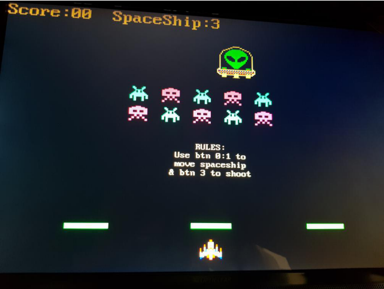
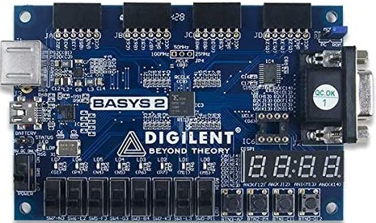

# FPGA-based-Space-Invaders-video-game
FPGAs provide incredible flexibility for digital electronics design, including gaming hardware. 
They have been used to create one-to-one recreations of a variety classic gaming hardware, often adding new features or modern upgrades.
In this project we implemented a slightly modified version of Space Invaders using the digilent basys2 FPGA.
The "main" code regarding all of the game's graphics can be found in the "spaceinvaders_graph.vhd" file. 
Where most state machines and registers are.

This is how it looks like:

And this is the FPGA that we used:

